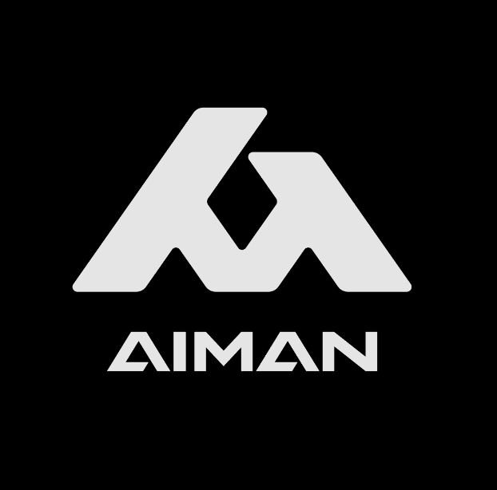
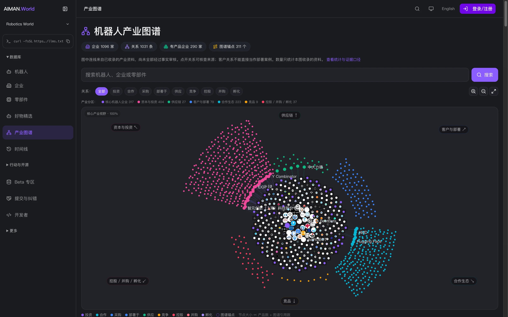

<p align="center"></p>

<p align="center"><a href="README.md">简体中文</a> · <strong>English</strong></p>

<h1 align="center">AIMAN.World</h1>

<p align="center"><strong>A robotics industry database that keeps updating itself.</strong></p>

<p align="center">Robots · Companies · Parts · Capabilities · Relationships · Events · Evidence</p>

<p align="center"><a href="https://www.aiman.world/en">Website ↗</a> · <a href="#film">Watch the film</a> · <a href="#agent">Connect your agent</a> · <a href="docs/pages.md">Page gallery</a></p>

<a id="film"></a>

**Full film · 59 seconds · with sound**

https://github.com/user-attachments/assets/9f8ea78b-3e26-477e-92e7-360043f7a39c

<p align="center"><a href="https://www.youtube.com/watch?v=Nf6XYuYUlrc"><strong>▶ Original film in 4K on YouTube</strong></a> · <a href="assets/video/aiman-world-intro.mp4?raw=true">Open / download MP4</a> · <a href="https://www.youtube.com/@AIMAN-World-Hub">YouTube channel</a></p>

**AIMAN is infrastructure that keeps an industry database up to date. Robotics World, known as 聚身之家 in Chinese, is its current public robotics domain.**

We organize robots, companies, parts, capabilities, relationships and events, retaining sources and changes over time. People can browse the website; agents can query the same public data through MCP.

This repository provides a product overview, an existing promotional film, real website screenshots and agent connection guides. Counts, prices and interfaces in the media reflect the time of recording. Current records come from the live website and APIs.

## Explore the product

| What you need | Entry |
| --- | --- |
| Robot records and specifications | [Robot catalog](https://www.aiman.world/en/robots) |
| Company profiles and industry roles | [Companies](https://www.aiman.world/en/companies) |
| Part records and specifications | [Parts](https://www.aiman.world/en/parts) |
| Industry relationships and their sources | [Industry graph](https://www.aiman.world/en/graph) |
| Historical events and current observations | [Timeline](https://www.aiman.world/en/timeline) |
| Open-source robots, projects and resources | [Open source](https://www.aiman.world/en/open-source) |
| Screenshots of 19 public pages | [Page gallery](docs/pages.md) |

<p align="center"><a href="https://www.aiman.world/en/graph"></a></p>

<a id="agent"></a>

## Connect your agent

Public MCP queries require no login or API key. Use **`https://www.aiman.world/mcp`** with **Streamable HTTP**. The current implementation uses stateless JSON-RPC request / response calls.

**Codex**

```bash
codex mcp add aiman-world --url https://www.aiman.world/mcp
```

**Claude Code**

```bash
claude mcp add --transport http --scope user aiman-world https://www.aiman.world/mcp
```

Reopen the client session and discover the current tools with `tools/list`. Try asking:

- “Find three open-source robotic arms. Include product links and mark missing specifications as unknown.”
- “Find Unitree's products, open one record and explain the sources behind its specifications.”
- “Compare these two robots. Separate verified parameters from unverified catalog claims.”

Tools cover robot search and comparison, company records and relationships, parts, state history, public World assertions and evidence, and published articles. Parameter names come from the live schemas; do not infer them from the REST API.

[Connection guide and tool groups (Chinese)](docs/agent.md) · [Verified examples (Chinese)](docs/examples.md) · [Online MCP documentation](https://www.aiman.world/en/developers/robotics/mcp) · [Agent Card](https://www.aiman.world/.well-known/agent-card.json)

## Evidence and scope

Missing data stays unknown. A source page does not prove every claim. Industry-source relationships displayed in `/graph` are distinct from reviewed Canonical relationships returned by `world.graph`. An empty Canonical result does not establish that no real-world relationship exists.

Public contributions enter a review inbox only: `canonicalWrites=false`. A successful submission is not a fact update. Part compatibility is not proof of installation; deployment success is not proof of better labor conditions. Broader reviewed deployment coverage and verified task matching remain work in progress. Beta pages explain their own limitations.

[Data boundaries (Chinese)](docs/data-boundaries.md) · [Methodology (Chinese)](https://www.aiman.world/methodology)

## Feedback

[Open an issue](https://github.com/Azhu9701/AIMAN-World-Hub/issues) with the affected page, the specific discrepancy and supporting sources. Use the website's [contact page](https://www.aiman.world/en/contact) for business inquiries.

---

Repository organization was inspired by [AI Safety HOT Hub](https://github.com/wuyoscar/AISafetyHot-Hub). AIMAN.World text and media were assembled independently. [Media notice](NOTICE.md) · [Verification record (Chinese)](docs/verification.md)
