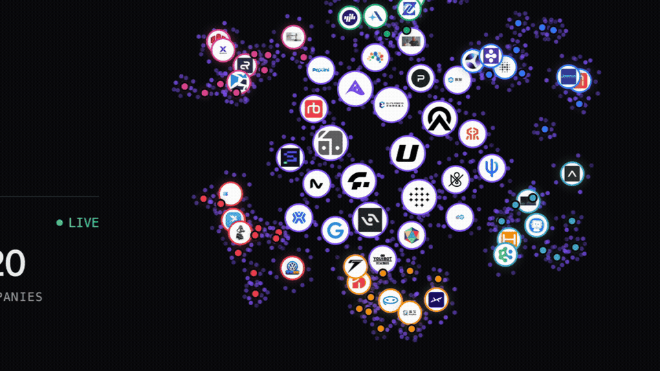
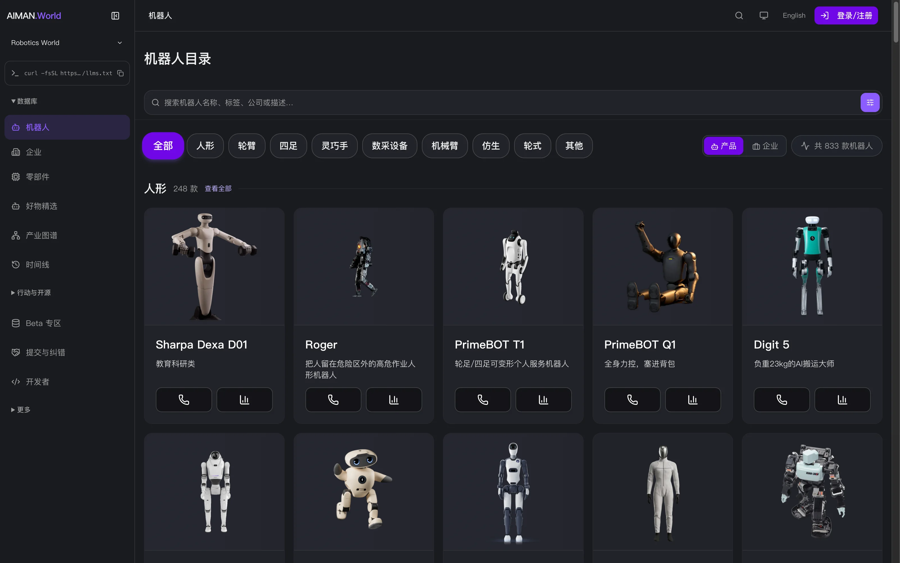
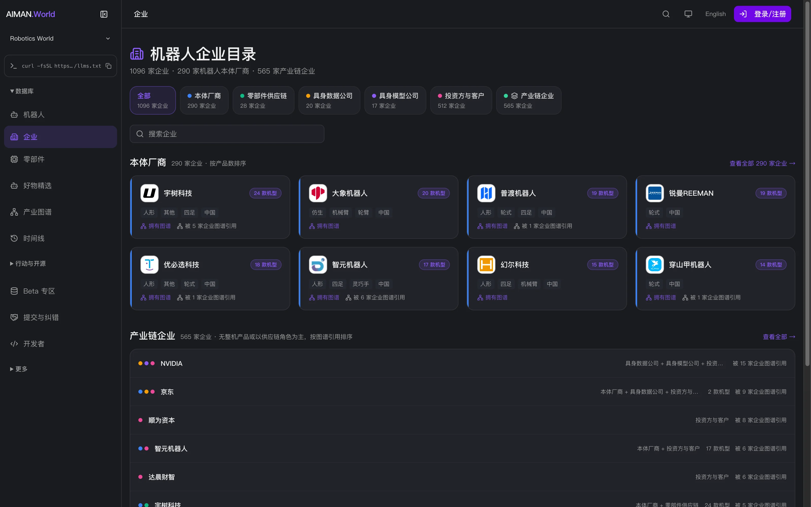
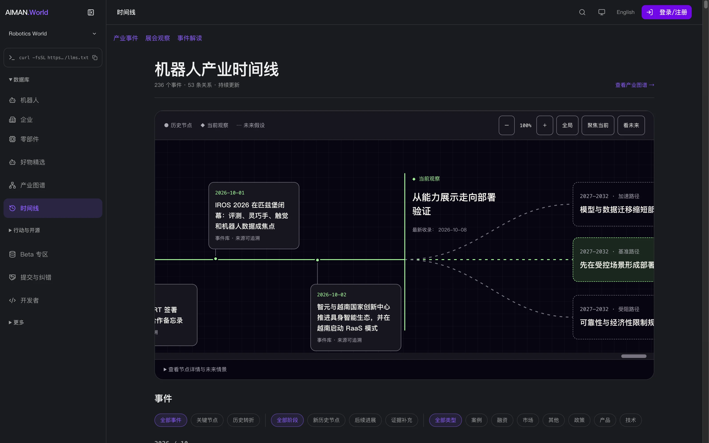
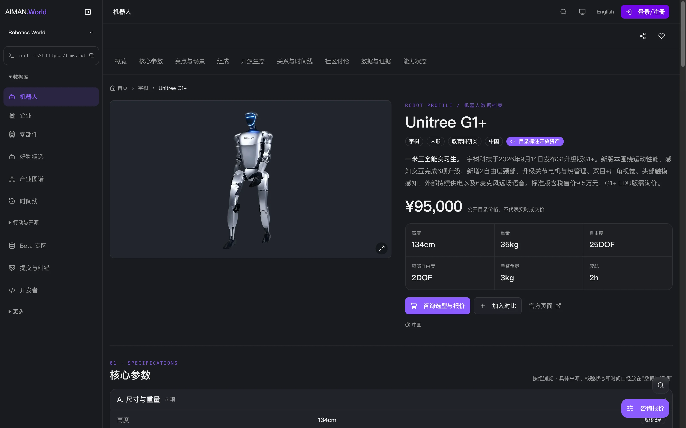
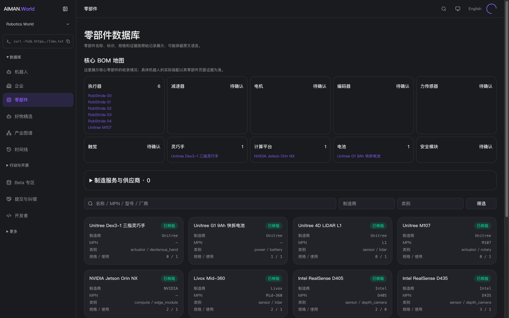
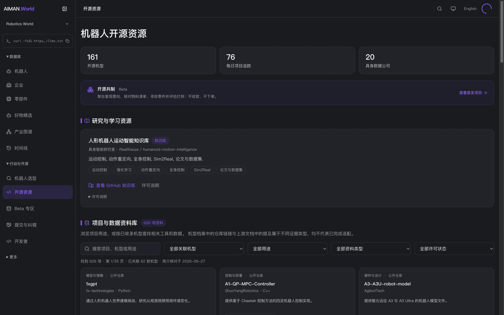
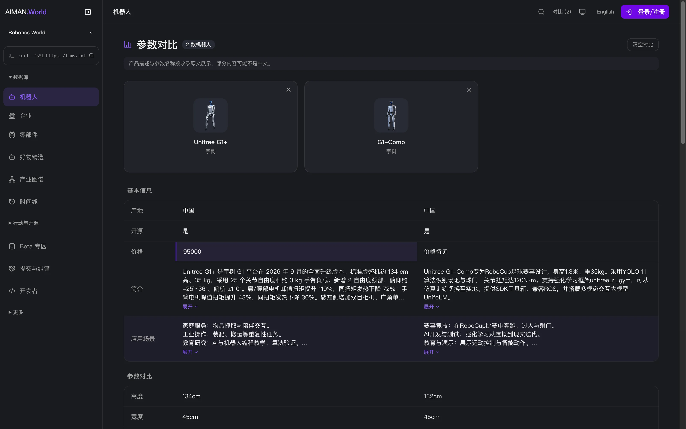

<p align="center"></p>

<p align="center"><strong>简体中文</strong> · <a href="README.en.md">English</a></p>

<h1 align="center">AIMAN.World · 聚身之家</h1>

<p align="center"><strong>一张会自己更新的机器人产业数据库。</strong></p>

<p align="center">机器人 · 企业 · 零部件 · 能力 · 产业关系 · 事件 · 证据</p>

<p align="center">
  <a href="https://www.aiman.world/">访问网站 ↗</a> ·
  <a href="#film">看宣传片</a> ·
  <a href="#pages">浏览页面</a> ·
  <a href="#agent">接入你的 Agent</a> ·
  <a href="https://www.aiman.world/graph">产业图谱</a> ·
  <a href="https://www.aiman.world/timeline">时间线</a>
</p>

<a id="film"></a>

<p align="center">
  <a href="https://www.youtube.com/watch?v=Nf6XYuYUlrc"></a>
</p>

<p align="center"><a href="https://www.youtube.com/watch?v=Nf6XYuYUlrc"><strong>▶ YouTube 完整宣传片 · 59 秒</strong></a> · <a href="assets/video/aiman-world-intro.mp4?raw=true">打开 / 下载 MP4</a> · <a href="https://www.youtube.com/@AIMAN-World-Hub">YouTube 频道</a></p>

**AIMAN 是一套让行业数据库自己持续更新的基础设施。聚身之家是它当前的机器人产业入口。**

新闻告诉你今天发生了什么；我们继续整理这件事涉及哪家公司、哪款产品、什么能力和关系，并保存来源、时间与后续变化。你可以在网页上查资料，也可以让自己的 Agent 通过 MCP 查询同一套公开数据。

这里是 AIMAN.World 的**产品展示与 Agent 接入仓库**。宣传片、真实页面截图和接入说明都在这里；正式数据以网站及接口的当前返回为准。宣传片和截图中的数量、价格与界面是拍摄时的记录。

## 你可以用它做什么

| 你想做什么 | 从哪里开始 |
| --- | --- |
| 找机器人，查看形态、参数和公开资料 | [机器人目录](https://www.aiman.world/robots) |
| 查一家企业的产品、产业角色和关系来源 | [企业目录](https://www.aiman.world/companies) |
| 找执行器、传感器、计算平台等零部件 | [零部件数据库](https://www.aiman.world/parts) |
| 看企业之间的投资、供应与合作资料 | [产业图谱](https://www.aiman.world/graph) |
| 追踪发布、融资、技术进展和历史变化 | [产业时间线](https://www.aiman.world/timeline) |
| 按任务和现场约束建立候选集、对比参数 | [机器人选型](https://www.aiman.world/robot-selection) |
| 找开源机型、代码、模型和数据资料 | [开源资源](https://www.aiman.world/open-source) |
| 让自己的 Agent 查询公开数据 | [MCP 接入指南](docs/agent.md) |

<a id="pages"></a>

## 看看现在的 AIMAN.World

以下截图取自 **2026-10-10 的公开网站**。点击图片进入对应页面。

<table>
  <tr>
    <td width="50%"><strong>机器人目录</strong><br><a href="https://www.aiman.world/robots"></a></td>
    <td width="50%"><strong>企业与产品</strong><br><a href="https://www.aiman.world/companies"></a></td>
  </tr>
  <tr>
    <td><strong>产业图谱</strong><br><a href="https://www.aiman.world/graph"></a></td>
    <td><strong>产业时间线</strong><br><a href="https://www.aiman.world/timeline"></a></td>
  </tr>
  <tr>
    <td><strong>机器人档案</strong><br><a href="https://www.aiman.world/robot/g1-2"></a></td>
    <td><strong>零部件数据库</strong><br><a href="https://www.aiman.world/parts"></a></td>
  </tr>
  <tr>
    <td><strong>开源资源</strong><br><a href="https://www.aiman.world/open-source"></a></td>
    <td><strong>参数对比</strong><br><a href="https://www.aiman.world/compare"></a></td>
  </tr>
</table>

[查看全部 19 个页面截图与入口 →](docs/pages.md)

<a id="agent"></a>

## 接入你的 Agent

公开 MCP 查询无需登录或 API Key。服务器地址：**`https://www.aiman.world/mcp`**，连接方式为 **Streamable HTTP**，当前提供无状态 JSON-RPC 请求 / 响应。

**Codex**

```bash
codex mcp add aiman-world --url https://www.aiman.world/mcp
```

**Claude Code**

```bash
claude mcp add --transport http --scope user aiman-world https://www.aiman.world/mcp
```

重新打开客户端会话后，先让 Agent 获取工具清单。当前工具与参数以远端 `tools/list` 为准，详细用法见 [Agent 接入指南](docs/agent.md)。

| 你想做什么 | 相关 MCP 工具 |
| --- | --- |
| 找机器人、按能力筛选 | `search_robots`、`find_robots_by_capability` |
| 读产品资料、并排对比 | `get_robot`、`compare_robots` |
| 查企业和产业关系资料 | `search_companies`、`get_company`、`get_company_relationships` |
| 找零部件、查产品组成 | `search_parts`、`get_part`、`get_robot_parts`、`match_parts` |
| 读实体、正式关系、事件与公开证据 | `world.entity`、`world.graph`、`world.timeline`、`world.evidence`、`world.assertion` |
| 看状态变化和公开劳动证据 | `get_current_state`、`get_state_transition_history`、`labor.query` |
| 读已发布的产业文章 | `list_blog_posts`、`get_blog_post` |

### 连接后，直接这样问

- “找 3 款开源机械臂，附产品链接；缺失参数请标成未知。”
- “查宇树科技有哪些产品，打开一款，说明参数来自哪里。”
- “比较这两款机器人，把有来源的参数与待核验资料分开。”
- “看这家企业的关系和历史变化，保留来源、日期和审核状态。”

[查看已验证的调用示例](docs/examples.md) · [在线开发者入口](https://www.aiman.world/developers) · [Agent Card](https://www.aiman.world/.well-known/agent-card.json) · [llms.txt](https://www.aiman.world/llms.txt)

## 资料怎样保持可信

```text
收集信息 → 确认对象身份 → 合并同一件事 → 核实来源
       → 通过受控入口更新 → 保存证据和历史 → 网页 / API / MCP 共用
```

这是系统建设的闭环，不表示所有环节都已全自动运行。

- **不知道就保留未知。** 目录描述、厂商声明和已核验事实有不同状态。
- **每项重要判断需要直接支持它的证据。** 一个来源链接不证明页面上的全部说法。
- **产业资料图谱与正式审核的关系分开。** `/graph` 中的资料连线不全部等于 `world.graph` 中的 Canonical 关系；没有正式关系返回，也不代表现实中一定没有关系。
- **公开贡献先待审。** `submit_contribution` 只进入审核收件箱，`canonicalWrites=false`；提交成功不代表正式数据已更新。
- **演示、订单、试运行与量产分开。** 部件匹配不代表实际装配，机器人部署不直接证明工时、安全或工作条件改善。

[事实与证据方法](https://www.aiman.world/methodology) · [数据与能力边界](docs/data-boundaries.md)

## 一起完善

发现错漏，可以在本仓库 [提交 Issue](https://github.com/Azhu9701/AIMAN-World-Hub/issues)，附页面、具体问题和支持材料。产品资料与企业贡献入口见 [提交资料与审核](https://www.aiman.world/developers/contribute)；商务咨询见 [联系方式](https://www.aiman.world/contact)。

如果这个入口对你有用，欢迎点 Star，也欢迎把它分享给需要机器人资料或 Agent 数据接口的人。

---

仓库组织参考 [AI Safety HOT Hub](https://github.com/wuyoscar/AISafetyHot-Hub)。本仓库文案与素材围绕 AIMAN.World 重新整理。[素材说明](NOTICE.md) · [本次验证记录](docs/verification.md)
