# 页面画廊

[返回首页](../README.md) · [宣传片](../assets/video/aiman-world-intro.mp4)

以下 19 个截图于 **2026-10-10** 从未登录的公开网站采集，浏览器视口为 1600×1000，像素倍率为 2，沿用网站深色主题。保留真实数量、来源提示与 Beta 标签；截图不表示其中所有资料已独立完成事实核验。

点击图片访问网站，点击截图文件可以放大。对比页需要先在产品页“加入对比”；本次选择了 Unitree G1+ 与 G1-Comp。

<table>
  <tr>
    <td width="50%"><strong>首页</strong> <a href="https://www.aiman.world/">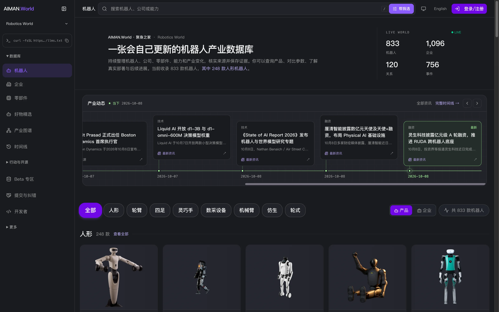</a> <a href="../assets/screenshots/home.webp">放大截图</a> · <a href="https://www.aiman.world/">打开页面 ↗</a></td>
    <td width="50%"><strong>机器人目录</strong>  <a href="../assets/screenshots/robots.webp">放大截图</a> · <a href="https://www.aiman.world/robots">打开页面 ↗</a></td>
  </tr>
  <tr>
    <td width="50%"><strong>企业目录</strong>  <a href="../assets/screenshots/companies.webp">放大截图</a> · <a href="https://www.aiman.world/companies">打开页面 ↗</a></td>
    <td width="50%"><strong>零部件数据库</strong>  <a href="../assets/screenshots/parts.webp">放大截图</a> · <a href="https://www.aiman.world/parts">打开页面 ↗</a></td>
  </tr>
  <tr>
    <td width="50%"><strong>产业图谱</strong>  <a href="../assets/screenshots/graph.webp">放大截图</a> · <a href="https://www.aiman.world/graph">打开页面 ↗</a></td>
    <td width="50%"><strong>产业时间线</strong>  <a href="../assets/screenshots/timeline.webp">放大截图</a> · <a href="https://www.aiman.world/timeline">打开页面 ↗</a></td>
  </tr>
  <tr>
    <td width="50%"><strong>机器人详情</strong>  <a href="../assets/screenshots/robot-detail.webp">放大截图</a> · <a href="https://www.aiman.world/robot/g1-2">打开页面 ↗</a></td>
    <td width="50%"><strong>企业详情</strong> <a href="https://www.aiman.world/company/%E5%AE%87%E6%A0%91%E7%A7%91%E6%8A%80">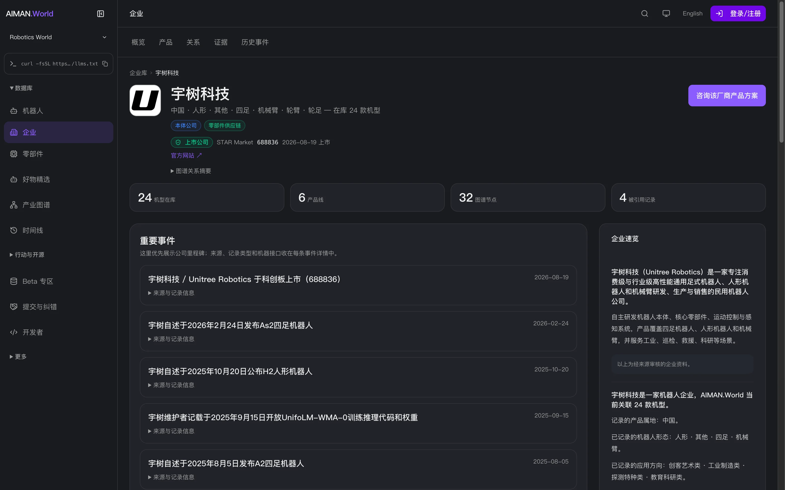</a> <a href="../assets/screenshots/company-detail.webp">放大截图</a> · <a href="https://www.aiman.world/company/%E5%AE%87%E6%A0%91%E7%A7%91%E6%8A%80">打开页面 ↗</a></td>
  </tr>
  <tr>
    <td width="50%"><strong>参数对比</strong>  <a href="../assets/screenshots/compare.webp">放大截图</a> · <a href="https://www.aiman.world/compare">打开页面 ↗</a></td>
    <td width="50%"><strong>机器人选型</strong> <a href="https://www.aiman.world/robot-selection">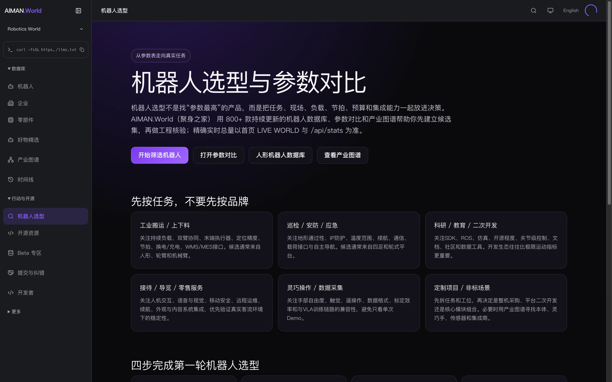</a> <a href="../assets/screenshots/selection.webp">放大截图</a> · <a href="https://www.aiman.world/robot-selection">打开页面 ↗</a></td>
  </tr>
  <tr>
    <td width="50%"><strong>开源资源</strong>  <a href="../assets/screenshots/open-source.webp">放大截图</a> · <a href="https://www.aiman.world/open-source">打开页面 ↗</a></td>
    <td width="50%"><strong>行业资讯</strong> <a href="https://www.aiman.world/blog">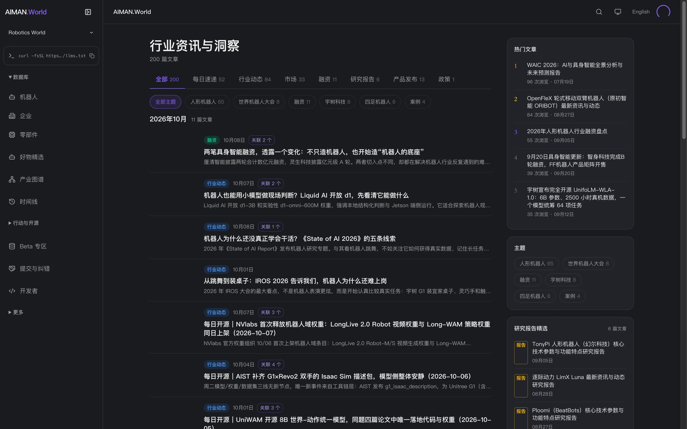</a> <a href="../assets/screenshots/blog.webp">放大截图</a> · <a href="https://www.aiman.world/blog">打开页面 ↗</a></td>
  </tr>
  <tr>
    <td width="50%"><strong>文章详情</strong> <a href="https://www.aiman.world/blog/robotics-infrastructure-liqing-lingsheng-funding-2026-oct">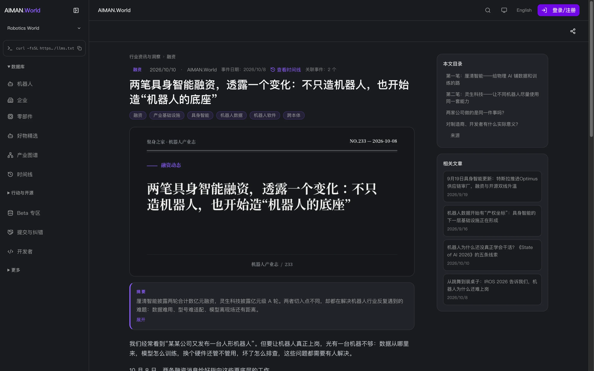</a> <a href="../assets/screenshots/article.webp">放大截图</a> · <a href="https://www.aiman.world/blog/robotics-infrastructure-liqing-lingsheng-funding-2026-oct">打开页面 ↗</a></td>
    <td width="50%"><strong>机器人好物</strong> <a href="https://www.aiman.world/goods">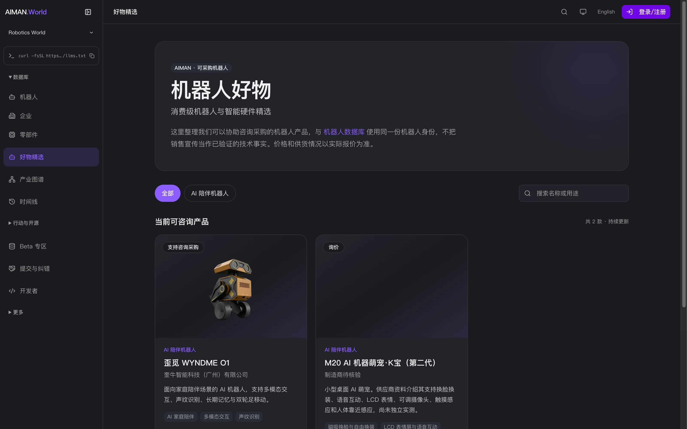</a> <a href="../assets/screenshots/goods.webp">放大截图</a> · <a href="https://www.aiman.world/goods">打开页面 ↗</a></td>
  </tr>
  <tr>
    <td width="50%"><strong>Beta 专区</strong> <a href="https://www.aiman.world/beta">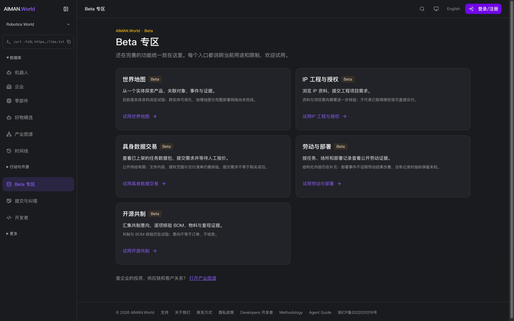</a> <a href="../assets/screenshots/beta.webp">放大截图</a> · <a href="https://www.aiman.world/beta">打开页面 ↗</a></td>
    <td width="50%"><strong>提交资料与审核</strong> <a href="https://www.aiman.world/developers/contribute">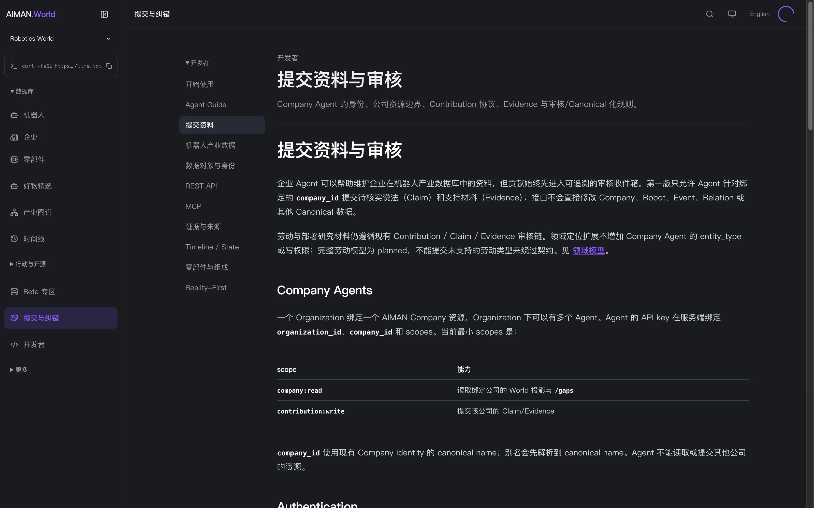</a> <a href="../assets/screenshots/contribute.webp">放大截图</a> · <a href="https://www.aiman.world/developers/contribute">打开页面 ↗</a></td>
  </tr>
  <tr>
    <td width="50%"><strong>开发者入口</strong> <a href="https://www.aiman.world/developers">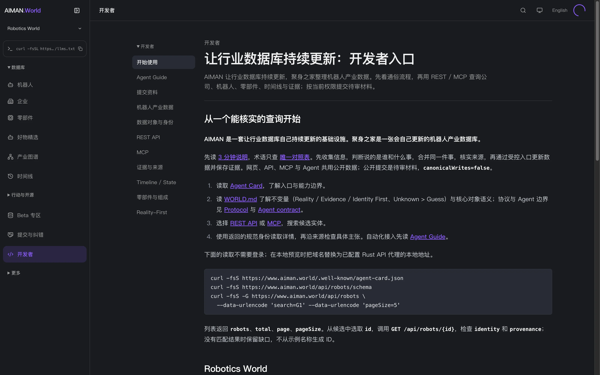</a> <a href="../assets/screenshots/developers.webp">放大截图</a> · <a href="https://www.aiman.world/developers">打开页面 ↗</a></td>
    <td width="50%"><strong>事实与证据方法</strong> <a href="https://www.aiman.world/methodology">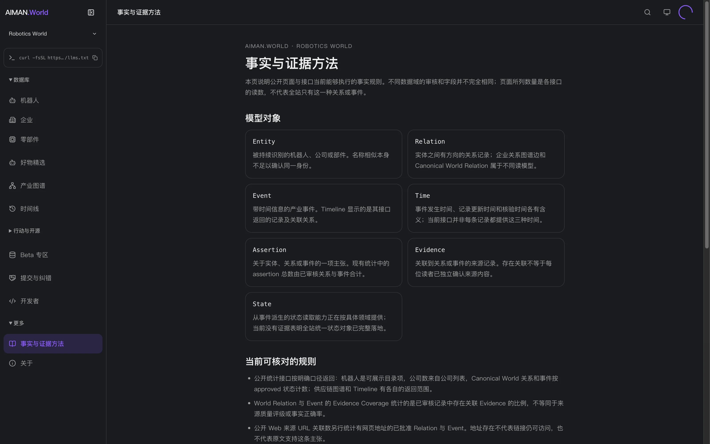</a> <a href="../assets/screenshots/methodology.webp">放大截图</a> · <a href="https://www.aiman.world/methodology">打开页面 ↗</a></td>
  </tr>
  <tr>
    <td width="50%"><strong>关于 AIMAN.World</strong> <a href="https://www.aiman.world/about">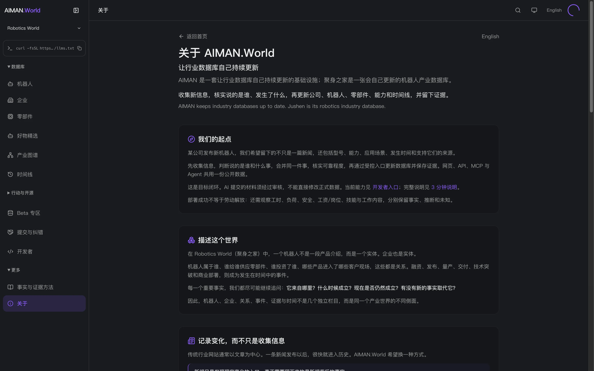</a> <a href="../assets/screenshots/about.webp">放大截图</a> · <a href="https://www.aiman.world/about">打开页面 ↗</a></td>
    <td></td>
  </tr>
</table>

## 宣传片

[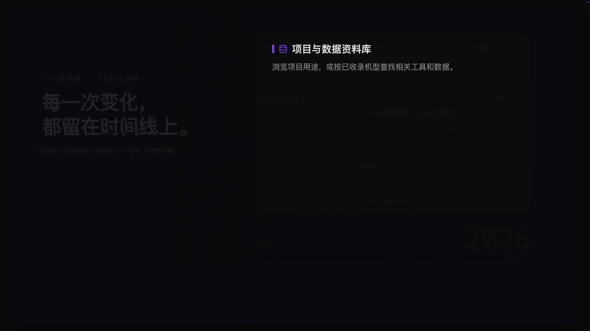](../assets/video/aiman-world-intro.mp4)

59 秒完整成片；本仓库提供 1080p H.264 / AAC 浏览副本。首页动态预览取原片 12–20 秒，省略音频；完整 MP4 保留音轨。原片拍摄日期未独立确认，其中的数量、界面与价格不表示今日状态。

[素材说明](../NOTICE.md) · [来源与校验清单](../assets/manifest.json)
